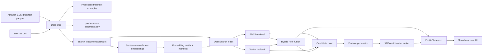
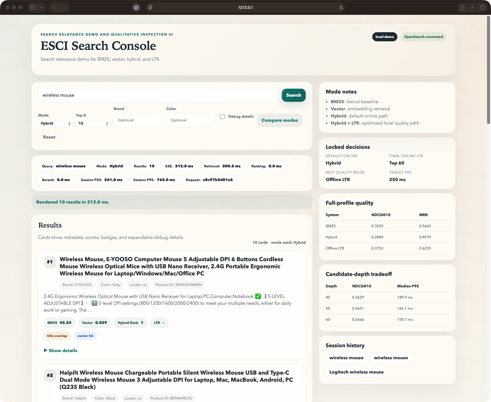
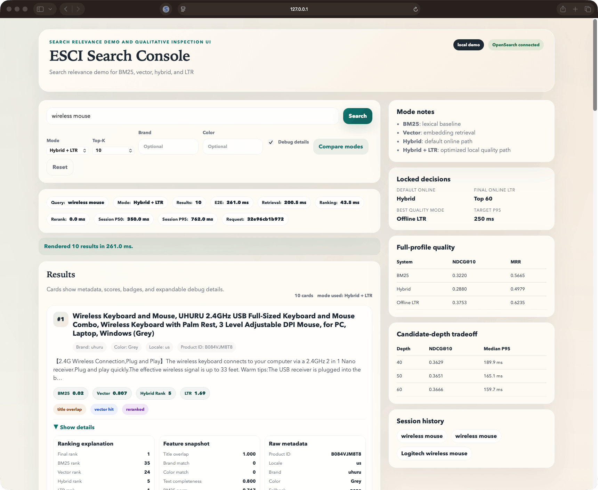
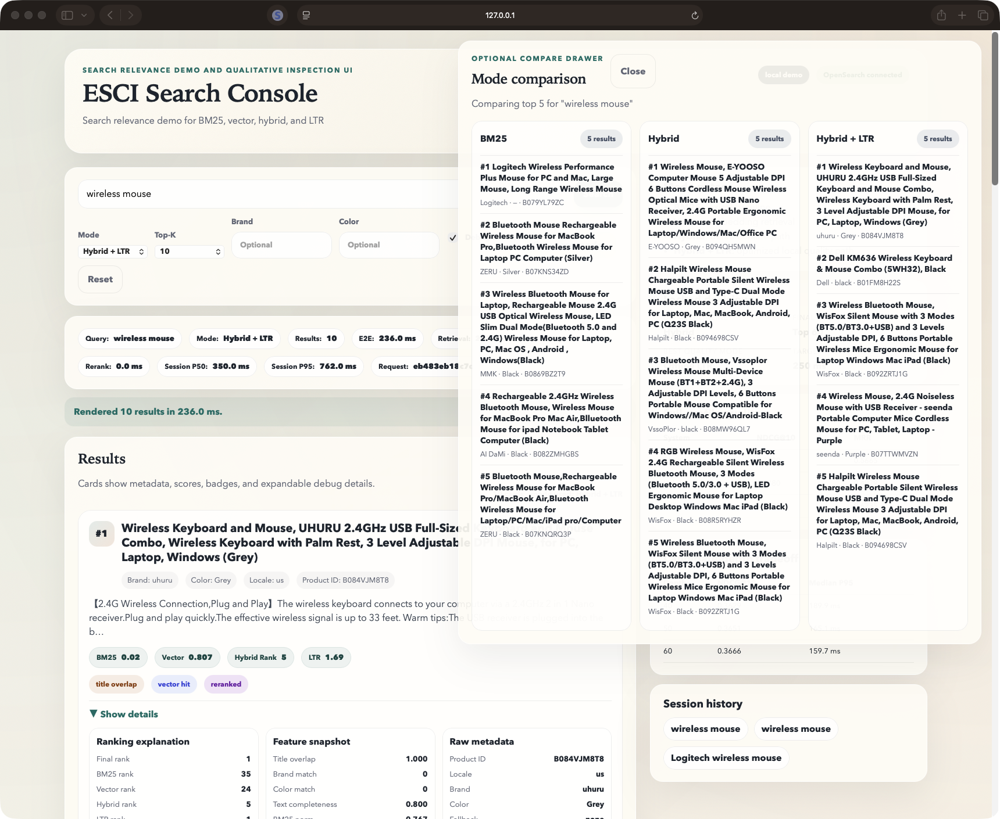

# Product Search Retrieval Ranking

Local-first product search, retrieval, and ranking system built on the Amazon ESCI dataset, combining BM25, vector retrieval, hybrid fusion, learning-to-rank, offline evaluation, FastAPI serving, and a thin inspection UI for relevance analysis.

## Tech Stack Snapshot

- **Backend / API:** Python 3.11/3.12, FastAPI, Uvicorn, Pydantic
- **Search / Retrieval:** OpenSearch, BM25, vector search, reciprocal rank fusion
- **ML / Ranking:** sentence-transformers, XGBoost, MLflow
- **Data / Evaluation:** pandas, parquet, NDCG@10, MRR, Precision@10, Recall@50/100
- **UI / Demo:** Jinja2, HTML, CSS, JavaScript
- **Engineering:** Docker Compose, pytest, GitHub Actions

## Why This Project Exists

Product search is a ranking problem, not just a keyword lookup problem. This repository was built to demonstrate end-to-end relevance engineering under realistic local constraints: data preparation, candidate retrieval, feature generation, learning-to-rank, evaluation, serving, latency measurement, and qualitative inspection.

The motivating question is straightforward: how far can a production-style retrieval and ranking stack go on a single local machine before complexity stops being worth it? The repo keeps both quality and latency visible, instead of optimizing only one side of the tradeoff.

## What This Project Builds

This project builds:

- a data preparation pipeline for the US `small_version == 1` slice of Amazon ESCI
- offline evaluation artifacts: queries, judgments, baseline runs, metrics reports, and per-query outputs
- a single-node OpenSearch index for BM25 and vector retrieval
- a hybrid retrieval layer using reciprocal rank fusion
- an XGBoost learning-to-rank workflow with feature generation and local MLflow tracking
- a FastAPI service with `/search`, `/debug/search`, `/explain`, `/health`, and a root inspection UI
- latency benchmarking and candidate-depth sweep scripts for local serving tradeoff analysis
- a documented shipped-state decision: hybrid as the default online path, optimized online LTR as the richer mode, and cross-encoder reranking deferred

Out of scope in the shipped repo:

- production deployment
- cloud-scale infrastructure
- cross-encoder reranking in the live path
- user auth, persistence-heavy frontend features, or a separate frontend product

## Architecture / Workflow



| Component | Role |
| --- | --- |
| Data prep | Filters to `locale=us` and `small_version == 1`, normalizes text, builds processed examples, queries, judgments, and lexical baseline runs |
| Retrieval | Runs BM25 and vector search against the same OpenSearch index |
| Hybrid ranking | Fuses lexical and vector candidates with client-side reciprocal rank fusion |
| LTR | Reranks the BM25/vector candidate union with an XGBoost listwise model |
| Serving | Exposes search, debug, explain, health, and the root inspection UI through FastAPI |
| Evaluation | Computes NDCG@10, MRR, Precision@10, Recall@50, and Recall@100 |
| Ops | Provides local doctor checks, indexing utilities, retrieval benchmarks, latency benchmarks, and CI |

## Key Features

### Retrieval and Ranking

- BM25, vector, hybrid, and `ltr` serving modes
- Brand and color filters in the live retriever
- Client-side reciprocal rank fusion for hybrid ranking
- Online LTR with one query embedding per request and precomputed product-side stats
- Fallback-aware search responses for richer modes

### Evaluation and Analysis

- Offline relevance evaluation with NDCG@10, MRR, Precision@10, Recall@50, and Recall@100
- Saved full-profile reports for BM25, hybrid, and LTR
- Latency benchmarking for live API modes
- Candidate-depth sweeps for local quality/latency tradeoff analysis
- Failure analysis grounded in saved per-query outputs

### API and UI

- FastAPI endpoints: `/search`, `/debug/search`, `/explain`, `/health`, `/`
- Thin search console with mode selector, top-k selection, filters, debug toggle, compare drawer, and session history
- Result cards with metadata, raw scores, rank positions, and latency breakdowns

### Engineering

- Installable Python package with optional retrieval and ranking extras
- Docker Compose OpenSearch service for local development
- Local MLflow integration for ranking experiments
- Unit tests and GitHub Actions CI across Python `3.11` and `3.12`

## Technical Implementation

### Core modules

| Path | Responsibility |
| --- | --- |
| `src/data_prep/prepare.py` | Builds processed examples, queries, judgments, search documents, baseline runs, and a data quality report |
| `src/indexing/embeddings.py` | Generates and saves product embeddings plus a manifest |
| `src/indexing/opensearch.py` | Creates the index, indexes documents, checkpoints progress, and runs BM25/vector queries |
| `src/retrieval/service.py` | Implements BM25/vector/hybrid retrieval, RRF fusion, live filtering, request timings, fallbacks, and query benchmarking |
| `src/features/extractor.py` | Builds LTR features from retrieval scores, ranks, overlap features, metadata matches, and text completeness |
| `src/ranking/train.py` | Trains XGBoost rankers, evaluates validation performance, exports models, and logs to MLflow |
| `src/ranking/service.py` | Serves the selected ranker in the online `ltr` path |
| `src/evaluation/metrics.py` | Computes NDCG@10, MRR, Precision@10, Recall@50, and Recall@100 |
| `src/api/app.py` | Exposes the FastAPI app and root search console UI |

### Execution flow

1. `scripts/prepare_data.py` builds processed train/test examples, qrels, search documents, and baseline runs.
2. `scripts/build_index.py generate-embeddings` creates the embedding matrix and manifest.
3. `scripts/build_index.py create-index` and `index-documents` build the OpenSearch corpus.
4. `scripts/build_index.py benchmark-retrieval` saves BM25/vector/hybrid runs for training and evaluation.
5. `scripts/train_ranker.py` builds LTR features, trains XGBoost, saves the selected model, and writes ranking reports.
6. `scripts/run_eval.py` evaluates offline runs against ESCI judgments.
7. `uvicorn api.app:app` serves the API and search console.
8. `scripts/benchmark_latency.py` and `scripts/sweep_ltr_candidate_depth.py` measure online tradeoffs.

### Outputs and artifacts

- Processed data: `data/processed/<profile>/`
- Offline runs: `data/evaluation/<profile>/runs/`
- Reports: `data/evaluation/<profile>/reports/`
- Retrieval cache: `data/cache/retrieval/<profile>/`
- Local MLflow runs: `mlruns/`

### Verification hooks

- `pytest tests/unit -q`
- `.github/workflows/ci.yml` compiles `src` and `scripts` and runs unit tests on Python `3.11` and `3.12`
- `scripts/doctor.py` checks disk space, raw data paths, parquet readability, and local services

## Data / Inputs / Assumptions

- **Dataset:** Amazon ESCI (public product search relevance dataset)
- **Configured raw inputs:** `esci-data-main/shopping_queries_dataset/data/esci_train.parquet`, `esci-data-main/shopping_queries_dataset/data/esci_test.parquet`, and `esci-data-main/shopping_queries_dataset/shopping_queries_dataset_sources.csv`
- **Supported slice in this repo:** `locale=us`, `small_version == 1`
- **Raw data policy:** heavy raw files are not committed to the repo; regenerate local artifacts instead of expecting checked-in datasets
- **Artifact policy:** processed parquet files, OpenSearch data, retrieval caches, and MLflow runs are intentionally local-only

Verified full-profile data summary from `data/evaluation/full/reports/data_quality.json`:

| Measure | Value |
| --- | ---: |
| Filtered rows | 613,016 |
| Unique queries | 29,844 |
| Unique products | 482,105 |
| Test queries | 8,956 |
| Test products | 164,900 |

Important assumptions:

- Only `locale=us` is supported in the live API path
- The reported latency numbers were validated on a 16 GB Apple Silicon Mac Mini; they are local measurements, not production SLAs
- OpenSearch runs as a single-node local service
- Results and latency numbers are local measurements, not production claims

## Methodology / Approach

The repository follows a staged retrieval and ranking methodology:

1. Build a lexical baseline from the filtered ESCI slice.
2. Add vector retrieval using `sentence-transformers/all-MiniLM-L6-v2`.
3. Fuse BM25 and vector candidates with reciprocal rank fusion.
4. Train an XGBoost listwise ranker over retrieval scores, rank positions, query/document overlap, brand/color matches, source priors, and text completeness features.
5. Compare quality offline, then test whether richer ranking paths fit a local latency budget online.

The repo keeps three truths visible instead of collapsing them into one story:

- `BM25` is the strongest unre-ranked offline baseline in the saved reports.
- `hybrid` is the default live path because it is latency-safe and operationally simpler.
- Offline `ltr` is the quality ceiling, while optimized online `ltr` is an optional richer path.

## Evaluation / Results

### Offline quality

Verified full-profile test results from saved reports:

| System | NDCG@10 | MRR | Precision@10 | Recall@50 | Recall@100 |
| --- | ---: | ---: | ---: | ---: | ---: |
| BM25 | 0.3220 | 0.5665 | 0.2955 | 0.3778 | 0.4524 |
| Hybrid | 0.2880 | 0.4979 | 0.2706 | 0.3767 | 0.4591 |
| Offline LTR | 0.3753 | 0.6235 | 0.3439 | 0.4211 | 0.4818 |

Interpretation:

- Offline `ltr` is the strongest quality mode in the saved full-profile results.
- `BM25` remains the strongest unre-ranked baseline, which keeps the baseline story honest.
- `Hybrid` is not the offline quality winner, but it remains valuable because it is the default latency-safe live path.

### Online latency

Verified local latency reports:

| Mode | P50 ms | P95 ms | Query count | Notes |
| --- | ---: | ---: | ---: | --- |
| Hybrid | 120.0 | 145.2 | 25 | Default live path |
| LTR after one optimization pass | 204.4 | 310.6 | 25 | Improved but still close to budget |

Repeated warm-state candidate-depth sweep:

| LTR depth | NDCG@10 | Median P95 ms | Mean P95 ms | Decision |
| --- | ---: | ---: | ---: | --- |
| 40 | 0.3629 | 189.9 | 204.0 | Lower quality, noisier latency |
| 50 | 0.3651 | 165.1 | 167.5 | Stable but slightly weaker than `60` |
| 60 | 0.3666 | 159.7 | 162.6 | Final online LTR setting |

Interpretation:

- The repo did not force the highest-quality path into the default online experience.
- `top 60` is the best saved local tradeoff for online `ltr`.
- These numbers are local measurements on the documented hardware profile, not deployment SLAs.

### Qualitative examples

Saved failure analysis shows clear wins and regressions:

- Misspelling recovery: `ashwaghanda extract`
- Near-title semantic recovery: `triggered donald trump jr`
- Hybrid rescue where LTR regresses: `swiss gear carry on luggage`
- Brand-heavy LTR regression: `belt for women guess`

## Demo / Screenshots / Example Outputs

### Search console

Hybrid search console:



LTR debug view:



Compare drawer:



### Example queries for walkthroughs

- `wireless mouse`
- `ashwaghanda extract`
- `triggered donald trump jr`
- `belt for women guess`

### API surface

```bash
curl "http://127.0.0.1:8000/health"
curl "http://127.0.0.1:8000/search?q=wireless+mouse&mode=hybrid&locale=us&k=10"
curl "http://127.0.0.1:8000/debug/search?q=wireless+mouse&mode=ltr&locale=us&k=10"
```

## Reproducibility / Quickstart

### Prerequisites

- Python `3.11` or `3.12`
- Local ESCI raw data under `esci-data-main/` as configured in `configs/services.yaml`
- Docker-compatible runtime for OpenSearch when running retrieval or the API

### 1. Base setup

```bash
python3 -m venv .venv
source .venv/bin/activate
python -m pip install --upgrade pip setuptools wheel
pip install -e ".[dev]"
python scripts/doctor.py --profile dev
```

### 2. Build the offline dev slice

```bash
python scripts/prepare_data.py --profile dev
python scripts/run_eval.py --profile dev --system baseline --split test --gain-mapping default
pytest tests/unit -q
```

### 3. Build the full retrieval / ranking stack

```bash
pip install -e ".[retrieval,ranking,dev]"
python scripts/prepare_data.py --profile full
docker-compose up -d opensearch
python scripts/build_index.py --profile full create-index
python scripts/build_index.py --profile full generate-embeddings
python scripts/build_index.py --profile full index-documents
python scripts/build_index.py --profile full benchmark-retrieval --split train --mode all
python scripts/build_index.py --profile full benchmark-retrieval --split test --mode all
python scripts/train_ranker.py --profile full --objective listwise --gain-mapping default
python scripts/run_eval.py --profile full --system bm25 --split test --gain-mapping default
python scripts/run_eval.py --profile full --system hybrid --split test --gain-mapping default
python scripts/run_eval.py --profile full --system ltr --split test --gain-mapping default
```

### 4. Run the API and UI

```bash
ESCI_PROFILE=full PYTHONPATH=src .venv/bin/python -m uvicorn api.app:app --host 127.0.0.1 --port 8000
```

Open [http://127.0.0.1:8000/](http://127.0.0.1:8000/).

### 5. Reproduce latency reports

```bash
python scripts/benchmark_latency.py --profile full --endpoint search --mode hybrid
python scripts/benchmark_latency.py --profile full --endpoint search --mode ltr
python scripts/sweep_ltr_candidate_depth.py --profile full --depths 40 50 60 --latency-queries 25
```

## Repository Structure

```text
product-search-retrieval-ranking/
├── assets/
│   └── screenshots/
├── configs/
│   ├── local_ports.yaml
│   └── services.yaml
├── data/
│   ├── evaluation/
│   ├── processed/
│   ├── raw/
│   └── README.md
├── docs/
│   ├── architecture.md
│   ├── failure_analysis.md
│   ├── final_results.md
│   ├── lessons_learned.md
│   ├── local_setup.md
│   ├── portfolio_walkthrough.md
│   └── ui_plan_spec.md
├── scripts/
│   ├── benchmark_latency.py
│   ├── build_index.py
│   ├── doctor.py
│   ├── prepare_data.py
│   ├── run_eval.py
│   ├── sweep_ltr_candidate_depth.py
│   └── train_ranker.py
├── src/
│   ├── api/
│   ├── common/
│   ├── data_prep/
│   ├── evaluation/
│   ├── features/
│   ├── indexing/
│   ├── ranking/
│   └── retrieval/
├── tests/
│   └── unit/
├── docker-compose.yml
├── pyproject.toml
└── README.md
```

## What I Built / Ownership

I implemented the project code, documentation, evaluation workflow, and GitHub packaging for:

- ESCI data preparation and filtered local dataset assembly
- offline evaluation reports and metric computation
- OpenSearch indexing utilities and retrieval benchmarking
- BM25, vector, hybrid, and online LTR retrieval logic
- LTR feature generation and XGBoost ranker training
- FastAPI endpoints and the search inspection UI
- local benchmarking scripts, tests, and CI wiring

This repository does not claim ownership of the external datasets, services, models, or libraries it builds on:

- the Amazon ESCI dataset
- the OpenSearch service or container image
- third-party model weights such as `sentence-transformers/all-MiniLM-L6-v2`
- external libraries including FastAPI, XGBoost, MLflow, pandas, and pytest

## Design Decisions and Tradeoffs

- **Keep `BM25` visible instead of weakening the baseline.** The saved reports show it is the strongest unre-ranked baseline.
- **Use `hybrid` as the default live path.** It keeps the system aligned with the retrieval-plus-ranking architecture while staying inside the local latency budget.
- **Treat offline `ltr` as the quality ceiling.** It improves quality meaningfully, but not every query gets better online.
- **Lock online `ltr` at `top 60`.** Repeated warm-state sweeps showed the best saved local quality/latency balance there.
- **Keep the UI thin.** The root page exists to make ranking behavior legible, not to turn the repo into a separate frontend project.
- **Defer cross-encoder reranking.** It would add more CPU-heavy inference and operational complexity than the current local scope justifies.

## Limitations / Honest Scope

- Local-first prototype and portfolio project, not a verified production deployment
- Single-node OpenSearch setup only
- Supports `locale=us` and `small_version == 1` only
- Heavy raw data and generated artifacts are intentionally not versioned
- Latency numbers are tied to the documented local hardware profile
- The live UI is an inspection console, not a full product frontend
- Cross-encoder reranking is configured as future work, not part of the shipped path

## Future Improvements

- Offline-only cross-encoder reranker experiments before any live integration
- Stronger product-type features for brand-heavy fashion and accessory queries
- Better handling for ambiguous semantic queries and category drift
- More explicit cold-start versus warm-state benchmarking for online `ltr`
- Cloud or multi-node experiments only after the local tradeoff story stops being the main bottleneck

## Skills Demonstrated

### Search / Ranking
- Relevance engineering
- Information retrieval
- Vector search
- Reciprocal rank fusion
- Learning-to-rank with XGBoost

### Evaluation / ML Systems
- Offline ranking evaluation
- Benchmark analysis
- Latency-aware model serving
- Candidate-depth tradeoff analysis

### Engineering
- FastAPI service design
- OpenSearch indexing and local operations
- Testable Python package structure
- Technical tradeoff communication

## Supporting Docs

- `docs/architecture.md`
- `docs/final_results.md`
- `docs/failure_analysis.md`
- `docs/local_setup.md`
- `docs/portfolio_walkthrough.md`
- `docs/lessons_learned.md`
