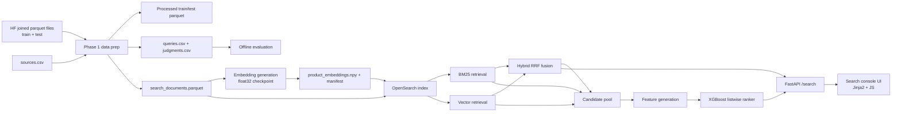

# Architecture

## System map

## Main components

- **Data prep**
  - derives `split=train|test` from parquet provenance
  - joins `source` from `shopping_queries_dataset_sources.csv`
  - filters to `locale=us` and `small_version == 1`
  - writes processed examples, judgments, queries, and search documents
- **Retrieval**
  - `BM25` and vector retrieval both run against the same single-node OpenSearch index
  - `hybrid` uses client-side RRF fusion
  - vector retrieval uses `sentence-transformers/all-MiniLM-L6-v2`
- **Ranking**
  - candidate pool is the de-duplicated union of BM25 and vector candidates
  - the selected champion is `XGBoost listwise + default gain mapping`
  - online `ltr` uses a reduced candidate depth and precomputed product-side stats
- **Serving**
  - FastAPI serves `/search`, `/debug/search`, `/health`, `/explain`, and `/`
  - the root `/` page is a thin inspection UI, not a separate frontend app
- **UI**
  - one-page search console with scores, badges, latency strip, debug details, compare drawer, and session history

## Runtime defaults

- default profile: `dev`
- supported locale: `us`
- supported dataset slice: `small_version == 1`
- OpenSearch: single-node, Docker-managed
- FastAPI: host-run
- MLflow: host-run when needed
- selected offline ranker: `listwise + default`
- default online serving path: `hybrid`
- final online LTR candidate depth: `60`
- best quality analysis mode: offline `ltr`
- Phase `5` cross-encoder reranking: deferred future work

## Request paths

### Hybrid

1. Query hits FastAPI `/search?mode=hybrid`
2. BM25 hits and vector hits are fetched from OpenSearch
3. RRF fusion combines them into one ranked list
4. Response returns latency split, scores, badges, and debug metadata

### LTR

1. Query hits FastAPI `/search?mode=ltr`
2. BM25 and vector candidates are fetched once
3. One query embedding is reused across the request
4. Product-side feature stats are hydrated from the precomputed online cache
5. XGBoost listwise scorer reranks the candidate set
6. Response returns final rank, feature snapshot, raw scores, and cross-mode rank positions

## Tradeoffs

### Why the UI exists even though it was not in the PRD

- The PRD focused on retrieval, ranking, and serving mechanics.
- The UI was added because the final repo needed a way to make ranking behavior inspectable in interviews and screenshots.
- The chosen scope stays narrow: a single page that explains the system instead of a separate frontend project.

### Why `hybrid` remains the default online path

- `BM25` is the strongest unre-ranked full-test baseline in the saved reports.
- `Hybrid` still remains the default interactive path because it is latency-safe, keeps the live serving path aligned with the retrieval-plus-ranking architecture, and is the cleaner operational base for `ltr`.
- In practice the repo now uses:
  - `BM25` as the strongest lexical baseline
  - `hybrid` as the default live demo path
  - offline `ltr` as the quality ceiling

### Why online LTR needed a separate optimization pass

- The naive online `ltr` path did redundant work:
  - repeated query embedding computation
  - repeated retrieval work inside the LTR path
  - request-time product-stat derivation
  - oversized candidate sets
- The final pass fixed the biggest avoidable costs:
  - one query embedding per request
  - no duplicate hybrid retrieval inside `ltr`
  - precomputed online product stats
  - constrained candidate depth

### Why `top 60` is locked

- A single optimized run got `ltr` close to target but not robust enough alone.
- Repeated 5-run sweeps across `40`, `50`, and `60` showed:
  - `40` lost too much quality and remained noisier
  - `50` was stable but slightly worse
  - `60` had the best quality and the best median/mean warm-state latency
- That is why `top 60` is the final online LTR configuration.

### Why Phase 5 is deferred

- A cross-encoder reranker would add another CPU-heavy inference stage on the same local machine.
- That would increase latency management, timeout handling, and fallback complexity beyond the value of the current shipped repo.
- The current system already has a coherent final state:
  - `BM25` as the strongest lexical baseline
  - `hybrid` as the default online path
  - offline `ltr` as the quality ceiling
  - optimized online `ltr` as the optional richer live mode

### UI-specific engineering note

- The compare drawer issues parallel requests across modes.
- That exposed a real race in lazy model initialization for the shared retriever singleton.
- The retriever now protects embedding-model and ranker initialization with locks so first-use parallel requests do not fall back unexpectedly.

## Main entrypoints

- `scripts/doctor.py`
- `scripts/prepare_data.py`
- `scripts/run_eval.py`
- `scripts/build_index.py`
- `scripts/train_ranker.py`
- `scripts/benchmark_latency.py`
- `src/api/app.py`
